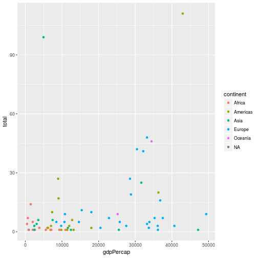

In this episode we will look at how to join tibbles together.  We will continue to use the gapminder data, and will look at how to join data on the medal performance of countries in the 2008 Olympics.  In doing so, we'll see some of the difficulties in working with real-world data, and will think about ways of solving them.

There are many ways of joining data in R; in common with the rest of this course we will focus on the tidyverse way, and use `dplyr` to join data.

## Loading the Olympic medal data

The [medal table for the 2008 Olympic games was downloaded from Wikipedia](https://en.wikipedia.org/wiki/2008_Summer_Olympics_medal_table) and converted to a csv file.  We can load this in the same way as the gapminder data:

~~~
medals <- read_csv("data/medals.csv")
~~~
{: .r}

~~~
Parsed with column specification:
cols(
  country = col_character(),
  gold = col_integer(),
  silver = col_integer(),
  bronze = col_integer()
)
~~~
{: .output}

We see that the column specification that `read_csv()` guessed looks reasonable; the countries are characters and columns containing the numbers of gold, silver and bronze medals have all been read as integers.

Before we join the two tables, complete the following challenges, which will generate a useful additional variable, and limit our gapminder data to the year closest to the medal data:

> ## Challenge: Generating medal totals
> 
> Use the `mutate` command to add a new column in your data-set
> called `total` that contains the total number of models awarded to 
> each country.  
>
> > ## Solution
> > 
> > 
> > ~~~
> > medals <- medals %>% mutate(total = gold + silver + bronze)
> > ~~~
> > {: .r}
> > 
> {: .solution}
{: .challenge}

> ## Challenge: Filtering the gapminder data
> 
> Use `dplyr` to create a new tibble, gap2007,  that only contains data for 2007;
> the year in our gapminder data-set that is closest to 2008.
> 
> > ## Solution
> > 
> > 
> > ~~~
> > gap2007 <- gapminder %>% filter(year == 2007)
> > ~~~
> > {: .r}
> > 
> {: .solution}
{: .challenge}

## Joining data tables

Before we join the `medals` and `gap2007` data, let's consider a smaller
example of the different ways we can join data.  The two data-sets we'll use are shown below:

~~~
# A tibble: 4 x 2
  animal  legs
   <chr> <dbl>
1    Cat     4
2    Dog     4
3   Bird     2
4  Sheep     4
~~~
{: .output}

~~~
# A tibble: 4 x 2
  animal sound
   <chr> <chr>
1    Cat  miaw
2  Sheep   baa
3    Dog growl
4   Bird tweet
~~~
{: .output}

We see that the same animals appear in the "legs" and "sound" tables, albeit in a different order.
Let's join these using an _inner join_.  This will join on the variable we specify, if _both_ tables
have an observation with the same value:

~~~
animalsoundlegs <- animallegs %>% inner_join(animalsound, by = "animal")
print(animalsoundlegs)
~~~
{: .r}

~~~
# A tibble: 4 x 3
  animal  legs sound
   <chr> <dbl> <chr>
1    Cat     4  miaw
2    Dog     4 growl
3   Bird     2 tweet
4  Sheep     4   baa
~~~
{: .output}

> ## Natural joins
>
> If we omit the `by` parameter from the join function, by default it will perform
> a _natural join_.  This means that the join will be performed on all variables with the 
> same name in both tables.  A message will be printed indicating the columns that
> have been used for the join.
>
> Do you think it is a good idea to make use of this feature?   Can you see any similarities
> to the discussion of the `col_types` argument of the `read_csv()` function?
> 
> > ## Solution
> > 
> > Although using natural joins can be a time-saver, it's safer to be explicit about 
> > the column(s) you're joining on.  It makes what your code is doing clearer to others
> > (and to you, when you revisit it).  If the format of your data changes, it will help
> > help prevent the code's behaviour changing. 
> > 
> > As with the `read_csv()` function, the join function prints out a message of the 
> > columns it has used to perform the join.  This is in the correct format to be copied and
> > pasted as a parameter to the function.  This can be a useful way of saving typing; you
> > can use natural joins while developing your code, check it's behaving as you expect,
> > and then convert them to named joins by pasting the `by = ...` message as a parameter 
> > to the join function.
> > 
> {: .solution}
{: .discussion}

## Left, right and full joins

The data tables we are joining  often won't contain the same observations.  To explore what happens when
we join data like this, let's load look at an extended version of the animal sounddata:

~~~
animalsound <- read_csv("data/animalsound.csv",
                        col_types = cols(
                           animal = col_character(),
                           sound = col_character()
                        )
)

animallegs <- read_csv("data/animallegs.csv",
                       col_types =
                         cols(
                           animal = col_character(),
                           legs = col_integer()
                         )
)

print(animalsound)
~~~
{: .r}

~~~
# A tibble: 5 x 2
  animal sound
   <chr> <chr>
1    Cat  miaw
2    Dog growl
3   Bird tweet
4    Dog  woof
5   Lion  roar
~~~
{: .output}

~~~
print(animallegs)
~~~
{: .r}

~~~
# A tibble: 4 x 2
  animal  legs
   <chr> <int>
1    Cat     4
2    Dog     4
3   Bird     2
4  Sheep     4
~~~
{: .output}

In the new data, dogs make two noises ("growl" and "woof").  Although sheep is included in the legs table, there is no corresponding entry in the sound table.  Lion is included in the sound table, but does not appear in the legs table.

> ## Challenge
>
> Use `inner_join` to join the two tables.  Can you explain the entries in the resulting tibble?
>
> > ## Solution
> > We can join the data in the same way as in the example:
> > 
> > ~~~
> > animallegs %>% inner_join(animalsound, by = "animal")
> > ~~~
> > {: .r}
> > 
> > 
> > 
> > ~~~
> > # A tibble: 4 x 3
> >   animal  legs sound
> >    <chr> <int> <chr>
> > 1    Cat     4  miaw
> > 2    Dog     4 growl
> > 3    Dog     4  woof
> > 4   Bird     2 tweet
> > ~~~
> > {: .output}
> >
> > The observation for sheep has been dropped; an inner join returns a row if the data can 
> > if found in _both_ tables.  
> > 
> > There is a one to many relationship for the sounds a dog can make.  We obtain an observation 
> > for each of these. 
> > 
> {: .solution}
{: .challenge}

As we saw in the challenge, there is a row in our results table for _each_ of the sounds a dog can make.  The `join` functions will return the [cartesian product](https://en.wikipedia.org/wiki/Cartesian_product) of the matching rows.  In other words, if we are performing a 1 to many, or many to many match, a row for _each_ matching combination of variables will be returned.

The `inner_join()` function only returns rows if the matching variable appears in _both_ tables being joined.  An outer join will return rows if the data appears in _either_ table being joined.  Things get a little more complex here; does the data need to appear in _any_ of the tables, or does it matter _which_ of the tables the data is in?

An `full_join()` will return a row if the data appears in _any_ of the tables being joined:

~~~
animalsound %>% full_join(animallegs, by = "animal")
~~~
{: .r}

~~~
# A tibble: 6 x 3
  animal sound  legs
   <chr> <chr> <int>
1    Cat  miaw     4
2    Dog growl     4
3   Bird tweet     2
4    Dog  woof     4
5   Lion  roar    NA
6  Sheep  <NA>     4
~~~
{: .output}

As "Sheep" appears in the legs table, but not the sound table, its value of sound is `NA`. "Lion" appears in the sound table, but not in the legs table; its value  of legs is `NA`.

A `left_join()` will return a row if the data appears in the left hand table we're joining; this is the table that appears first in the command:

~~~
animalsound %>% left_join(animallegs, by = "animal")
~~~
{: .r}

~~~
# A tibble: 5 x 3
  animal sound  legs
   <chr> <chr> <int>
1    Cat  miaw     4
2    Dog growl     4
3   Bird tweet     2
4    Dog  woof     4
5   Lion  roar    NA
~~~
{: .output}

A row is returned for each of the animals in sound table, matched to the legs table. If there isn't a corresponding entry in the legs table, `NA`s are returned for columns coming from the legs table.

> ## Challenge
> 
> Use `right_join()` to join `animalsound` and `animallegs`.    Can you reproduce this result using only a `left_join()`?
> (don't worry about the order of the columns in the resulting tibble)
> 
> > ## Solution
> > 
> > ~~~
> > animalsound %>% right_join(animallegs, by = "animal")
> > ~~~
> > {: .r}
> > 
> > 
> > 
> > ~~~
> > # A tibble: 5 x 3
> >   animal sound  legs
> >    <chr> <chr> <int>
> > 1    Cat  miaw     4
> > 2    Dog growl     4
> > 3    Dog  woof     4
> > 4   Bird tweet     2
> > 5  Sheep  <NA>     4
> > ~~~
> > {: .output}
> > 
> > Rows are returned for _each_ row in the legs table.  If there is no corresponding entry in the sound table,
> > `NA` is returned for these rows.
> >
> > If we reverse the order of the tables we can obtain the same result using a `left_join()`:
> >
> > 
> > ~~~
> > animallegs %>% left_join(animalsound, by = "animal")
> > ~~~
> > {: .r}
> > 
> > 
> > 
> > ~~~
> > # A tibble: 5 x 3
> >   animal  legs sound
> >    <chr> <int> <chr>
> > 1    Cat     4  miaw
> > 2    Dog     4 growl
> > 3    Dog     4  woof
> > 4   Bird     2 tweet
> > 5  Sheep     4  <NA>
> > ~~~
> > {: .output}
> >
> > Note that the order of the columns in the data are different; the join functions will
> > put columns from the right hand table after the columns from the left.   It is good practice to refer
> > to columns by name, rather than position; this is one of the reasons why.
> > 
> {: .solution}
{: .challenge}

##  More complex joins

FIXME Write this section.  Need to cover joins on variables with different names, joins on multiple variables

## The medals data

Now that we've seen the different types of join that exist, let's apply this to a more complex example, and return to the medals data.  We want to join the medals data to the 2007 gapminder data (which we created earlier in the `gap2007` tibble), so that we can explore whether factors like the GDP per capita and population of a country are related to the number of medals a country won. In this section we'll discover some of the problems that can occur when dealing with real-life data, and will think about ways we can solve them.

We are going to need to join the gapminder data to the medal data by country.   We would expect each country to appear at most once in each table.   We can check this is true by grouping each data set by country, getting a total of the number of times each country appears, and filtering this do only keep groups with a total >1:

FIXME: If we're going to cover functions, here would be a great place to use them.

~~~
gap2007 %>% group_by(country) %>%
  mutate(numoccur = n()) %>% 
  filter(numoccur > 1)
~~~
{: .r}

~~~
# A tibble: 0 x 7
# Groups:   country [0]
# ... with 7 variables: country <chr>, year <int>, pop <dbl>,
#   continent <chr>, lifeExp <dbl>, gdpPercap <dbl>, numoccur <int>
~~~
{: .output}

~~~
medals %>% group_by(country) %>%
  mutate(numoccur = n()) %>% 
  filter(numoccur > 1)
~~~
{: .r}

~~~
# A tibble: 0 x 6
# Groups:   country [0]
# ... with 6 variables: country <chr>, gold <int>, silver <int>,
#   bronze <int>, total <int>, numoccur <int>
~~~
{: .output}

> ## Challenge
> 
> How many rows are in each tibble?  Should we be worried about this?
> 
> > ## Solution
> > 
> > 
> > ~~~
> > nrow(gap2007)
> > ~~~
> > {: .r}
> > 
> > 
> > 
> > ~~~
> > [1] 142
> > ~~~
> > {: .output}
> > 
> > 
> > 
> > ~~~
> > nrow(medals)
> > ~~~
> > {: .r}
> > 
> > 
> > 
> > ~~~
> > [1] 87
> > ~~~
> > {: .output}
> > 
> > There are fewer rows in the medals table than the gapminder data.   At this stage we probably don't 
> > need to worry; not every country that entered the olympics will have won any medals.  
> > However, not every country
> > in the world is included in the gapminder data - [there are 195/6 countries in the world](https://www.infoplease.com/world/world-statistics/how-many-countries).
> > The medals data is an exhaustive list of all countries that won a medal. If the gapminder data contained
> > every country in the world we would expect _every_ entry in the medals data to match an entry in the gapminder
> > data.  However we wouldn't expect the opposite to be true; not every country won a medal.
> >
> {: .solution}
{: .challenge}

> ## Discussion - join types
> 
> In the previous section we looked at the different types of join; inner, left, right and full.  With your neighbour
> describe in words what would be the results of performing each of these types of join, by country, on
> the `gap2007` and `medals` data.  As we're trying look at the relationship between number of medals and variables
> included in the gapminder data, what do you think the most appropriate type of join would be?
{: .discussion}

We wish to keep all the countries (that we have) in the gapminder data, and join the medals data to this.  In order to do so, we use a left join. We'll also sort the data by the total number of medals won, in descending order:

~~~
gapmedals <- gap2007 %>% left_join(medals, by = "country") %>% 
  arrange(desc(total))
~~~
{: .r}

> ## Challenge
> 
> How many rows would you expect this table to have?   Perform the join and check your answer.
> 
> Take a look at the resulting table.  Does it appear to have worked OK?  Filter the tibble to 
> only show countries that don't appear to have won any medals.  Can you see any issues with this?
> 
> Hint: the `is.na()` function will return `TRUE` if a value is missing
>
> > ## Solution
> > We would expect the table to have 142 rows, since will keep every contry that appears
> > in the left hand table.  We have previously checked that each country appears once in each table
> > so we wouldn't expect more than 142 rows.
> > 
> > We can filter the resulting tibble to just show countries with a missing medal total:
> > 
> > ~~~
> > nomedals <- gapmedals %>% filter(is.na(total))
> > ~~~
> > {: .r}
> >
> > If we look at this tibble in Rstudio, we see that there are 76 counties with missing medal totals.
> > If we cross check this against the original data, we see that there are some countries are missing 
> > because the countries names are not all recorded consistently.  For example, the United Kingdom competes
> > under team name "Great Britain".
> >
> {: .solution}
{: .challenge}

We saw in the challenge that matching on strings can be unreliable; some country names were recorded differently in the two tables, preventing a match from being made.   Although it is beyond the scope of this course, there are several approaches we can use in this (not uncommon) situation, which are described below.  One thing you **shouldn't** do is manually alter either of the source data files so that the countries match.  Such an approach makes it impossible to reproduce your work, and would need to be repeated if either data-set were updated.  Better approaches include:

1. Go back to the person or organisation who provided you with the data, and ask for, e.g. standardised 3 character country codes to be provided with the data.  This often isn't possible, but it is the cleanest solution.
2. If the cause for the mis-matches is something that's consistent for all the values (e.g. a variable is recorded in upper case in one table and lower case in another, we can use `mutate` to create a new variable with the data in the correct format: `mutate(uppercountry=toupper(country))` will convert the values of `country` to upper-case).  
3. Construct a look-up table to map between the different ways of recording the data, and use this as an intermediate table when performing the join.   You should ideally construct the mapping table programatically so your research is reproducible; at the very least the mapping table should be included with your data, and you should include code in your analysis script to check that all the values have been accounted for.  For example, if we obtained newer gapminder data, an decided to reproduce the analysis for the 2012 olympics we would want to be sure that we'd not ignored any countries who had won a medal in 2012, but not in 2008.

FIXME This feels like it's going down a rabbit hole - simplify example data outwith lesson before getting to this
 point.  The code chunk introduces *far* to many new concepts - tribble, if, anti joins

~~~
# Deal with the countries that match anyway first:
countrymap <- gap2007 %>% 
  inner_join(medals, by = "country") %>% 
  select(country) %>% 
  rename(gapcountry = country) %>% 
  mutate(medalcountry = gapcountry)

manualcountry <- tribble(~gapcountry, ~medalcountry,
                         "United Kingdom", "Great Britain",
                         "etc.", "etc.")
countrymap <- bind_rows(countrymap, manualcountry)

# We can use an anti_join() to see which countries remain unaccounted for
gapnomedal <- gap2007 %>% anti_join(countrymap, by = c("country" = "gapcountry"))
medalnogap <- medals %>% anti_join(countrymap, by = c("country" = "medalcountry"))

# Check the number of unaccuonted for countries is what we'd expect

if (nrow(gapnomedal) != 75 || nrow(medalnogap) != 21) {
  warning("Some countries unaccounted for")
}
~~~
{: .r}

~~~
Warning: Some countries unaccounted for
~~~
{: .error}

~~~
# We use an inner join here since *all* countries should be accounted for
medaljoin2 <- gap2007 %>% 
  inner_join(countrymap, by = c("country" = "gapcountry")) %>% 
  inner_join(medals, by = c("medalcountry" = "country")) %>% 
  select(-medalcountry)
~~~
{: .r}

Having cleaned and joined our data we could use, e.g. `ggplot2` to explore the relationship between, say, population and medal total:

~~~
medaljoin2 %>% ggplot(aes(x = pop, y = total, colour = continent)) + 
  geom_point() + scale_x_log10()
~~~
{: .r}

