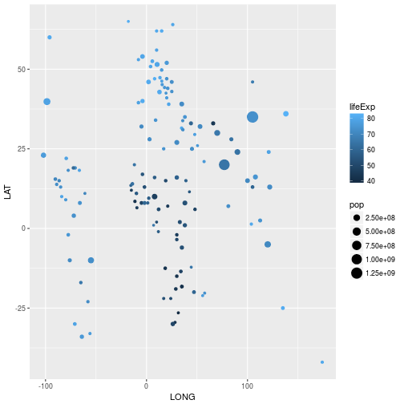

~~~
centroids <- read_csv("data/country_centroids_primary.csv")
~~~
{: .r}

~~~
Parsed with column specification:
cols(
  `LAT	LONG	DMS_LAT	DMS_LONG	MGRS	JOG	DSG	AFFIL	FIPS10	SHORT_NAME	FULL_NAME	MOD_DATE	ISO3136` = col_character()
)
~~~
{: .output}

~~~
Warning in rbind(names(probs), probs_f): number of columns of result is not
a multiple of vector length (arg 2)
~~~
{: .error}

~~~
Warning: 1 parsing failure.
row # A tibble: 1 x 5 col     row   col  expected    actual                                 file expected   <int> <chr>     <chr>     <chr>                                <chr> actual 1    27  <NA> 1 columns 3 columns 'data/country_centroids_primary.csv' file # A tibble: 1 x 5
~~~
{: .error}
Ah - it's not a CSV. This is why you should look at the data first.  Looks like it might be a tsv..

~~~
centroids <- read_tsv("data/country_centroids_primary.csv")
~~~
{: .r}

~~~
Parsed with column specification:
cols(
  LAT = col_double(),
  LONG = col_double(),
  DMS_LAT = col_integer(),
  DMS_LONG = col_integer(),
  MGRS = col_character(),
  JOG = col_character(),
  DSG = col_character(),
  AFFIL = col_character(),
  FIPS10 = col_character(),
  SHORT_NAME = col_character(),
  FULL_NAME = col_character(),
  MOD_DATE = col_date(format = ""),
  ISO3136 = col_character()
)
~~~
{: .output}

Column spec looks reasonable - things we'd expect to be numbers are.  Things we'd expect to be character are

## Joining data

We can use `dplyr` to join data.    It looks like we should try and match the `SHORT_NAME` column of the centroids data to the `country` column of the gapminder data.

~~~
gapcountries <- gapminder %>% select(country, year) %>% filter(year == 2007)
~~~
{: .r}

~~~
testjoin <- gapcountries %>% full_join(centroids, by=c("country"="SHORT_NAME"))
~~~
{: .r}

~~~
gapcent <- gapminder %>% inner_join(centroids, by=c("country"="SHORT_NAME"))
~~~
{: .r}

~~~
 gapminder %>%
  inner_join(centroids, by=c("country"="SHORT_NAME")) %>%
  filter(year==2007) %>%
  ggplot(aes(x=LONG, y=LAT, colour=lifeExp, size=pop)) + geom_point()
~~~
{: .r}

~~~
# Olympic medal table - all the loading and cleaning will be done outwith the lesson
# Just get participants to load cleaned version

library(rvest)
~~~
{: .r}

~~~
Loading required package: xml2
~~~
{: .output}

~~~

Attaching package: 'rvest'
~~~
{: .output}

~~~
The following object is masked from 'package:readr':

    guess_encoding
~~~
{: .output}

~~~
medals <- read_html("https://en.wikipedia.org/wiki/2008_Summer_Olympics_medal_table") %>% 
  html_nodes(xpath='//*[@id="mw-content-text"]/div/table[2]') %>% html_table(fill=TRUE)
medals <- medals[[1]]

medals <- medals %>%
  filter(Rank != "Total (87 NOCs)") %>% 
  mutate(country=stringr::str_split(NOC, " \\(", n=1))
~~~
{: .r}

